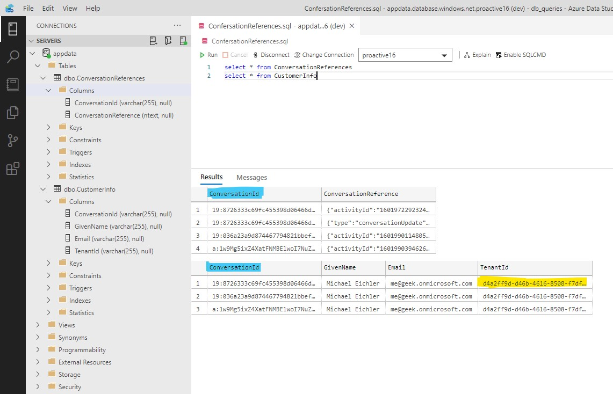
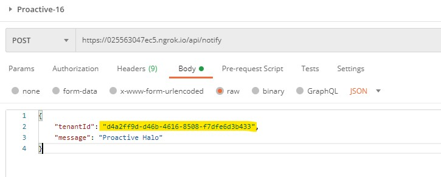

# Proactive Messages using SQL

Bot Framework v4 proactive messages bot sample based on sample [16.proactive-messages](https://github.com/microsoft/BotBuilder-Samples/tree/main/samples/javascript_nodejs/16.proactive-messages).

This bot has been created using [Bot Framework](https://dev.botframework.com), it shows how to send proactive messages to users by capturing a conversation reference, then using it later to initialize outbound messages.

## Concepts introduced in this sample

Typically, each message that a bot sends to the user directly relates to the user's prior input. In some cases, a bot may need to send the user a message that is not directly related to the current topic of conversation. These types of messages are called proactive messages.

Proactive messages can be useful in a variety of scenarios. If a bot sets a timer or reminder, it will need to notify the user when the time arrives. Or, if a bot receives a notification from an external system, it may need to communicate that information to the user immediately. For example, if the user has previously asked the bot to monitor the price of a product, the bot can alert the user if the price of the product has dropped by 20%. Or, if a bot requires some time to compile a response to the user's question, it may inform the user of the delay and allow the conversation to continue in the meantime. When the bot finishes compiling the response to the question, it will share that information with the user.

This project has a notify endpoint that will trigger the proactive messages to be sent to
all users who have previously messaged the bot.

## Proactive Messages

In addition to responding to incoming messages, bots are frequently called on to send "proactive" messages based on activity, scheduled tasks, or external events.

In order to send a proactive message using Bot Framework, the bot must first capture a conversation reference from an incoming message using `TurnContext.getConversationReference()`. This reference can be stored for later use.

To send proactive messages, acquire a conversation reference, then use `adapter.continueConversation()` to create a TurnContext object that will allow the bot to deliver the new outgoing message.

## Store Conversation References

An Azure SQL database with two tables is used. The 1st is used to store the conversation reference. The 2nd is used to store details about the recipient of future notifications.

|Table|Description|
|-----|-----------|
| ConversationReferences | Stores the object from the bot context as JSON |
| CustomerInfo | Stores additional data about the sender, who added the bot to the conversation, e.g. TenantId, Email, Configuration |

# Setup & Run the sample

## Prerequisites

- NGROK

- [Node.js](https://nodejs.org) version 10.14 or higher

    ```bash
    # determine node version
    node --version
    ```

- Visual Studio Code

- Postman

## Configure Azure for this sample

- Create a Channel Registration in Azure, add the Teams channel and the endpoint, e.g. https://123463047ec5.ngrok.io

- Create a Client Secret in the Azure App Registration for your bot 

## Setup SQL database

- Create a database in your Azure SQL instance

- Update the sqlconfig.js file with your values

### 1. ConversationReferences

This table is used to identify the conversation within MS Teams (channel, group or personal chat)

```
SET ANSI_NULLS ON
GO
SET QUOTED_IDENTIFIER ON
GO
CREATE TABLE [dbo].[ConversationReferences](
	[ConversationId] [varchar](255) NULL,
	[ConversationReference] [ntext] NULL
) ON [PRIMARY] TEXTIMAGE_ON [PRIMARY]
GO
```

### 2. CustomerInfo

This table is used to target the right recipient for an notification.

```
SET ANSI_NULLS ON
GO
SET QUOTED_IDENTIFIER ON
GO
CREATE TABLE [dbo].[CustomerInfo](
	[ConversationId] [varchar](255) NULL,
	[GivenName] [varchar](255) NULL,
	[Email] [varchar](255) NULL,
	[TenantId] [varchar](255) NULL
) ON [PRIMARY]
GO
```



## Run and debug this sample

- Clone the repository

- Install modules

    ```bash
    npm install
    ```

- Update the .env file with your AppId and Client Secret

- Run NGROK

    ```bash
    ngrok http -host-header=rewrite 3978
    ```

- Run the solution in Visual Studio Code

## Add the app to Teams

- Update the manifest with your AppId from Azure App Registration

- Zip and upload the manifest to Teams

- Add the bot to a team and start a conversation

## Sending Proactive Messages

Send a message to the /api/notify endpoint of the bot.

Include in the body:

```
{
    "tenantId": "d4a2ff9d-d46b-4616-8508-f7dfe6d3b433",
    "message": "Proactive Halo"
}
```

### Using Postman



### Avoiding Permission-Related Errors

You may encounter permission-related errors when sending a proactive message. This can often be mitigated by using `MicrosoftAppCredentials.trustServiceUrl()`. See [the documentation](https://docs.microsoft.com/en-us/azure/bot-service/bot-builder-howto-proactive-message?view=azure-bot-service-4.0&tabs=javascript#avoiding-401-unauthorized-errors) for more information.

## Deploy this bot to Azure

To learn more about deploying a bot to Azure, see [Deploy your bot to Azure](https://aka.ms/azuredeployment) for a complete list of deployment instructions.

## Further reading

- [Bot Framework Documentation](https://docs.botframework.com)
- [Bot Basics](https://docs.microsoft.com/azure/bot-service/bot-builder-basics?view=azure-bot-service-4.0)
- [Send proactive messages](https://docs.microsoft.com/en-us/azure/bot-service/bot-builder-howto-proactive-message?view=azure-bot-service-4.0&tabs=js)
- [continueConversation Method](https://docs.microsoft.com/en-us/javascript/api/botbuilder/botframeworkadapter#continueconversation)
- [getConversationReference Method](https://docs.microsoft.com/en-us/javascript/api/botbuilder-core/turncontext#getconversationreference)
- [Activity processing](https://docs.microsoft.com/en-us/azure/bot-service/bot-builder-concept-activity-processing?view=azure-bot-service-4.0)
- [Azure Bot Service Introduction](https://docs.microsoft.com/azure/bot-service/bot-service-overview-introduction?view=azure-bot-service-4.0)
- [Azure Bot Service Documentation](https://docs.microsoft.com/azure/bot-service/?view=azure-bot-service-4.0)
- [Azure CLI](https://docs.microsoft.com/cli/azure/?view=azure-cli-latest)
- [Azure Portal](https://portal.azure.com)
- [Language Understanding using LUIS](https://docs.microsoft.com/en-us/azure/cognitive-services/luis/)
- [Channels and Bot Connector Service](https://docs.microsoft.com/en-us/azure/bot-service/bot-concepts?view=azure-bot-service-4.0)
- [Restify](https://www.npmjs.com/package/restify)
- [dotenv](https://www.npmjs.com/package/dotenv)
